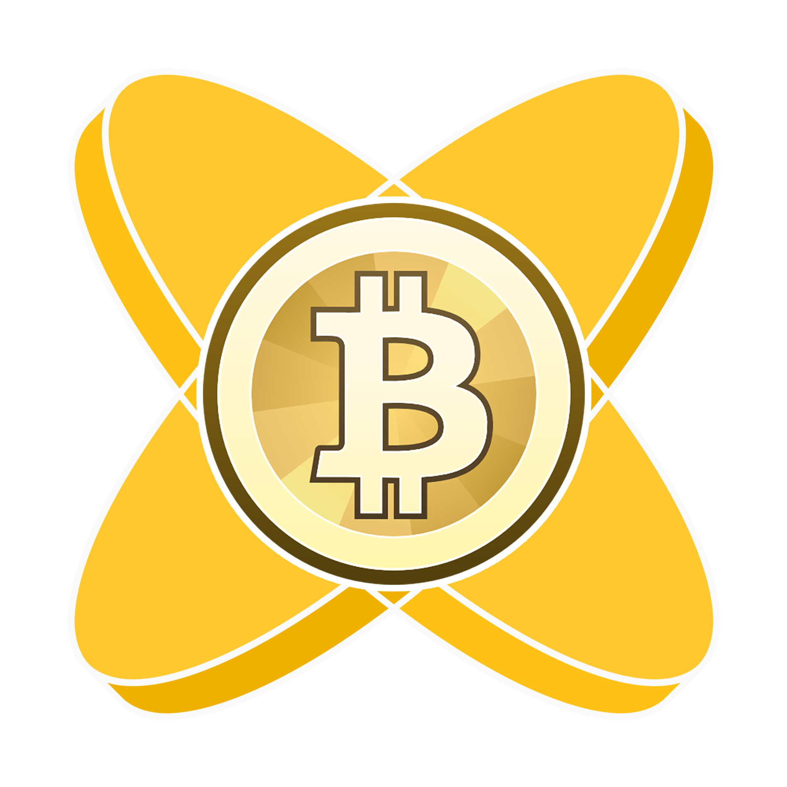

# Electsum

[]()
[]()

A Bitcoin watch-only wallet for iOS and Android built with Apache Cordova, compatible with Electrum deterministic wallets.



## Overview

Electsum allows you to monitor Bitcoin addresses generated from an Electrum-style Master Public Key (MPK). It's designed for users of the [Electrum](https://electrum.org/) wallet who want to watch their balances on mobile devices without exposing private keys.

**Key Features:**
- Watch-only wallet: View balances and transaction history without signing transactions
- Electrum-compatible: Uses the same deterministic key derivation algorithm
- Password protection: AES-encrypted storage for your Master Public Key
- Multiple address monitoring: Generate and track up to 100 addresses
- Real-time price display: BTC/USD conversion using Coinbase API
- QR code scanning: Import MPK via camera or share Bitcoin payments

## Requirements

- [Apache Cordova CLI](https://cordova.apache.org/) (v10+)
- iOS 10.0+ or Android 5.0+
- Xcode (for iOS development)
- Android SDK (for Android development)

## Installation

1. Clone the repository:
```bash
git clone https://github.com/skidvis/electsum.git
cd electsum
```

2. Add platforms:
```bash
cordova platform add ios
cordova platform add android
```

3. Install required plugins:
```bash
cordova plugin add https://github.com/phonegap/phonegap-plugin-barcodescanner.git
cordova plugin add cordova-plugin-camera
cordova plugin add cordova-plugin-device
cordova plugin add cordova-plugin-file
cordova plugin add cordova-plugin-inappbrowser
cordova plugin add cordova-plugin-media-capture
```

4. Build and run:
```bash
cordova build ios
cordova build android

# Or run on connected device/emulator
cordova run ios
cordova run android
```

## Configuration

The app stores encrypted settings in `localStorage`:
- **Password**: SHA-256 hashed and stored in `password`
- **Master Public Key**: AES-encrypted in `wordlist`
- **Address count**: Stored in `addressCount` (default: 15)

### Setup Flow

1. **First launch**: Creates an encrypted password
2. **MPK entry**: Enter your Electrum Master Public Key (or import via QR code)
3. **Address generation**: Generates deterministic addresses from the MPK
4. **Balance checking**: Fetches balances from blockchain.info API

## Usage

### Main Screen
- Lists all tracked addresses with current BTC balances
- Tap any address to view details
- Shows total balance and current BTC price

### Settings
- **Unlock**: Enter password to access MPK and settings
- **Address count**: Adjust number of addresses to track (1-100)
- **MPK management**: View and update your Master Public Key

### Address Details
- View BTC and USD balance
- Generate QR code for payments
- Link to blockchain.info for full transaction history

## Architecture

### Core Components

| File | Purpose |
|------|---------|
| `www/index.html` | UI pages using jQuery Mobile |
| `www/js/myScript.js` | Main app logic, API integration |
| `www/js/electrum.js` | Electrum deterministic wallet implementation |
| `www/js/bitcoinjs-min.js` | Bitcoin address/hash utilities |
| `www/js/aes.js` | Encryption for MPK storage |
| `www/js/mnemonic.js` | Word list generation (unused in current version) |
| `www/js/qrcode.min.js` | QR code generation |

### Key Derivation

The app uses Electrum's deterministic key derivation:
```
address = SHA256(SHA256(sequence:mode:MPK)) + MPK
```
Where `sequence` is the address index and `mode` is 0 (receive) or 1 (change).

### External Services
- **Price API**: `https://coinbase.com/api/v1/prices/spot_rate`
- **Blockchain API**: `http://blockchain.info/rawaddr/{address}`

## Plugins Used

| Plugin | Purpose |
|--------|---------|
| `cordova-plugin-camera` | QR code scanning for MPK import |
| `cordova-plugin-inappbrowser` | Opening external links |
| `cordova-plugin-file` | File system access |
| `cordova-plugin-media-capture` | Media handling |
| `cordova-plugin-device` | Device information |

## Platform Notes

### iOS
- Uses `.mobileprovision` file for signing
- Requires camera permission for QR scanning
- Supports iOS 10.0+

### Android
- Uses Cordova Android platform
- Requires camera permission for QR scanning
- Supports Android 5.0+

## Development

### Project Structure
```
electsum/
├── www/              # Web assets
│   ├── index.html    # Main UI
│   ├── css/          # jQuery Mobile theme
│   ├── js/           # Application JavaScript
│   └── config.xml    # Cordova configuration
├── platforms/        # Platform-specific builds
├── plugins/          # Installed Cordova plugins
└── screens/          # App screenshots
```

### Modifying the App
1. Edit files in `www/` directory
2. Run `cordova build` to compile
3. Test on emulator or device

## Known Limitations

- ⚠️ **Watch-only only**: Cannot sign or broadcast transactions
- ⚠️ **Password stored**: Password hash is stored in localStorage (not ideal security)
- ⚠️ **API dependency**: Relies on external blockchain.info and Coinbase APIs

## Contributing

Contributions are welcome! Please:
1. Fork the repository
2. Create a feature branch
3. Test thoroughly on both iOS and Android
4. Submit a pull request

## License

This project is open source and available under the MIT License.

## Author

**skidvis**

##Acknowledgments

- Built with [Apache Cordova](https://cordova.apache.org/)
- Uses [bitcoinjs-lib](https://github.com/bitcoinjs/bitcoinjs-lib)
- QR code implementation by [davidshimjs/qrcodejs](https://github.com/davidshimjs/qrcodejs)
